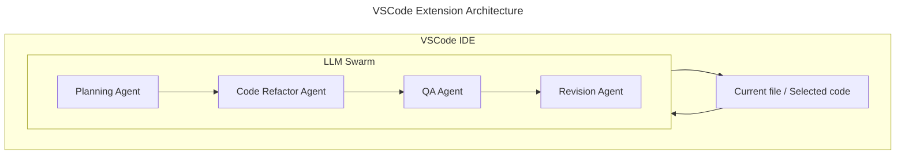

# CrewsControl <!-- omit from toc -->

A code improvement tool utlizing an AI agent swarm.

- [Project Overview](#project-overview)
  - [Description](#description)
  - [Status](#status)
- [Project Installation](#project-installation)
  - [Prerequisites](#prerequisites)
  - [Development Setup](#development-setup)
- [Project Structure](#project-structure)
- [Architecture and Design](#architecture-and-design)
  - [System Overview](#system-overview)
  - [Technologies Used](#technologies-used)
    - [Python package development](#python-package-development)
    - [VSCode Extension development](#vscode-extension-development)
    - [Similar Projects used as references](#similar-projects-used-as-references)
- [Usage](#usage)
  - [Python Package as CLI tool](#python-package-as-cli-tool)
  - [VSCode extension](#vscode-extension)
- [Testing](#testing)

## Project Overview

### Description

This project aims to build code improvement software that utlizes an AI agent swarm using locally hosted models. There are three components to this project:

- A Python package that can be used as a CLI to perform refactoring tasks.
- A VSCode extension that uses the Python package to perform tasks based on inputs derived from the IDE.
- A [research notebook](research/llm_swarm.ipynb) that documents the process of building the AI agent swarm.

### Status

The package can be used as a basic CLI tool to perform refactoring tasks on input code. It can accept the input as a string, or as a file/folder of files. This CLI functionality is primarily for testing purposes as it is not expected

The VSCode extension allows the user to run the AI agents on the currently open file or selected text in the IDE.

## Project Installation

### Prerequisites

- [Python 3.12.\*](https://www.python.org/) for running the Python package (as CLI or via extension)
- [Poetry](https://python-poetry.org/) for managing Python dependencies
- [VS Code](https://code.visualstudio.com/) for running the VSCode extension
- [Node.js 16.13.\*](https://nodejs.org/en) for the VSCode extension
- [Jupyter Notebook](https://jupyter.org/) for running the research notebook

> **_Note: a machine with a good GPU is highly recommended_**

### Development Setup

In terminal, install the Python dependencies and pre-commit hooks by running the following commands:

```shell
poetry install --no-root
poetry run pre-commit install
```

Then navigate to the vscode-extension directory, and create and activate a virtual environment:

```shell
cd vscode-extension
python -m venv venv

# On MacOS/Linux
source venv/bin/activate

# On Windows
.\venv\Scripts\activate
```

Install [nox](https://github.com/wntrblm/nox) in the activated environment:

```shell
python -m pip install nox
nox --session setup
```

**_Note: If this fails, you may have to install `rust`:_**

```shell
# Install Rust using rustup
curl --proto '=https' --tlsv1.2 -sSf https://sh.rustup.rs | sh

# Follow the on-screen instructions to complete the installation

# Add Cargo's bin directory to your PATH
# For zsh
echo 'export PATH="$HOME/.cargo/bin:$PATH"' >> ~/.zshrc
source ~/.zshrc

# For bash
echo 'export PATH="$HOME/.cargo/bin:$PATH"' >> ~/.bashrc
source ~/.bashrc

# Verify Rust installation
rustc --version
```

Finally, install `node` packages:

```shell
npm install
```

For more information on building and developing this extension, refer to the [VS Code python tools extension README](https://github.com/microsoft/vscode-python-tools-extension-template/blob/main/README.md).

## Project Structure

```text
├── README.md                       This file.
├── pyproject.toml                  Poetry configuration file for Python packages.
├── python-package
│   ├── src
│   │   └── llm-swarm
│   │       ├── ai
│   │       │   ├── agents.py       Defines the AI agents in the crew.
│   │       │   ├── crew.py         Defines the AI crew.
│   │       │   ├── models.py       Functions to retrieve models via Ollama.
│   │       │   └── tasks.py        Defines the tasks that the AI crew can perform.
│   │       ├── main.py             Main entry point for the Python package.
│   │       └── utils
│   │           └── cli.py          CLI tool for running the Python package.
│   └── tests
│       └── input                   Test input files.
├── research
│   ├── README.md                   Research documentation.
│   └── llm_swarm.ipynb             Jupyter notebook documenting the AI agent swarm.
├── test.sh                         Bash script for testing the Python package.
└── vscode-extension
    ├── README.md
    ├── bundled
    │   └── tool
    │       └── lsp_server.py       Python code called by extension.
    ├── eslint.config.js
    ├── noxfile.py                  Configuration file for Nox.
    ├── package.json                Node.js configuration file.
    ├── requirements.in             Python package requirements.
    └── src
        └── extension.ts            Main entry point for the VSCode extension.

```

Note: The `vscode-extension` folder is based on a [VSCode Extension Template](https://github.com/microsoft/vscode-python-tools-extension-template) - only modified files are included in this diagram.

## Architecture and Design

### System Overview



### Technologies Used

#### Python package development

- Python
- Poetry for package management
- Ollama
- CrewAI

#### VSCode Extension development

- TypeScript
- Node.js
- npm for package management

#### Similar Projects used as references

- Devin: <https://www.cognition-labs.com/introducing-devin>
- AutoGen: <https://github.com/microsoft/autogen>
- CrewAI: <https://github.com/joaomdmoura/crewai>
- ACE Framework: <https://github.com/daveshap/ACE_Framework>
- Hierarchical Autonomous Agent Swarm (HAAS): <https://github.com/daveshap/OpenAI_Agent_Swarm>

## Usage

### Python Package as CLI tool

```shell
# use -h to see args
poetry run cli
```

Alternatively, run the script directly with `poetry run python main.py`.

### VSCode extension

To run the extension in development, open the project in VSCode and select `Run > Start Debugging` from the top menu. This should open a new VSCode window where one can open some files and run the extension on them.

To build the extension, run the following command in the `vscode-extension` directory:

```shell
npx vsce package
```

This will create a `.vsix` file that can be installed in VSCode like a regular extension.

## Testing

There is a bash script in the root folder that runs the AI Crew on a set of test files found in `/python-package/tests/input`. Run it with:

```shell
./test.sh
```
