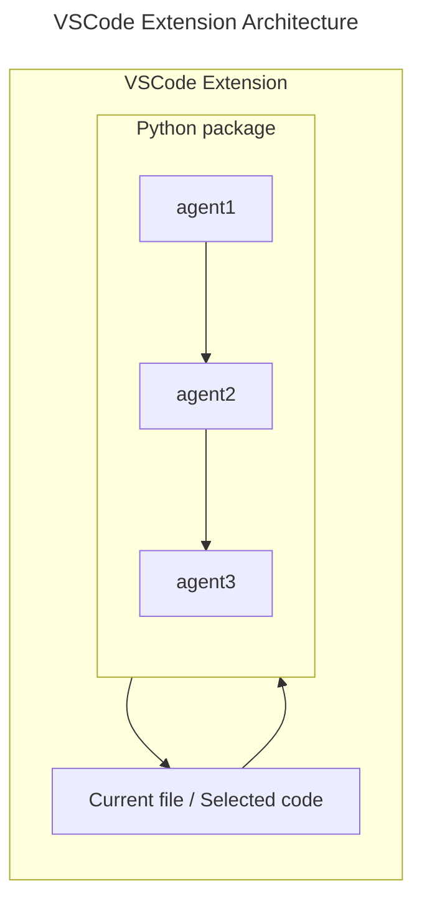

# AI Agent Swarm for Code Improvement <!-- omit from toc -->

- [Project Overview](#project-overview)
  - [Description](#description)
  - [Status](#status)
- [Installation](#installation)
  - [Prerequisites](#prerequisites)
  - [Setup](#setup)
  - [Configuration](#configuration)
- [Project Structure](#project-structure)
- [Architecture and Design](#architecture-and-design)
  - [System Overview](#system-overview)
  - [Technologies Used](#technologies-used)
    - [Python package](#python-package)
    - [VSCode Extension](#vscode-extension)
    - [Similar Projects used as references](#similar-projects-used-as-references)
  - [Modules and Components](#modules-and-components)
- [Usage](#usage)
  - [Examples](#examples)
    - [Python Package as CLI tool](#python-package-as-cli-tool)
  - [Screenshots](#screenshots)
- [Testing](#testing)
- [Deployment](#deployment)

## Project Overview

### Description

This project aims to build code improvement software that utlizes an AI agent swarm using remote OR locally hosted models. There are two main components to this project:

- A Python package that can be used as a CLI to perform AI tasks.
- A VSCode extension that uses the package to perform tasks based on inputs derived from the IDE.

### Status

🚧 Current status of the project (where is the project currently at)

## Installation

### Prerequisites

- [VS Code](https://code.visualstudio.com/)
- [Python 3.12.\*](https://www.python.org/)
- [Node.js 16.13.\*](https://nodejs.org/en)
- [Poetry](https://python-poetry.org/)
- [Jupyter Notebook](https://jupyter.org/) (if running research notebooks)
- A machine with a decent GPU (if running models locally) is highly recommended

### Setup

In terminal, in the root directory of the project, install the Python dependencies and pre-commit hooks by running the following commands:

```shell
poetry install --no-root
poetry run pre-commit install
```

Then navigate to the `vscode-extension` folder and install the required `npm` packages:

```shell
cd vscode-extension
npm install --save-dev \
  typescript \
  eslint@8.57.0 \
  @typescript-eslint/parser \
  @typescript-eslint/eslint-plugin \
  globals \
  prettier
```

### Configuration

(If using online models) Make a copy of `.env.example`, rename it to `.env`, and add the appropriate values for the environment variables.

## Project Structure

- Explain the directory structure and the purpose of each folder. (Just the ones you've worked on)
- Mention any key files and their functionalities.
  > The vscode-extension folder is based on a [VSCode Extension Template](https://github.com/microsoft/vscode-python-tools-extension-template)

```text
├── README.md
├── poetry.lock
├── pyproject.toml
├── python-package
│   ├── src
│   │   └── package
│   │       ├── ai
│   │       │   ├── agents.py               Defines the SWE AI agents in the crew.
│   │       │   ├── crew.py
│   │       │   ├── models.py
│   │       │   └── tasks.py              Defines the tasks that the AI crew can perform.
│   │       ├── main.py
│   │       └── utils
│   │           └── cli.py
│   └── tests
│       └── input
│           ├── factorial_recursive.py
│           └── flatten_list.py
├── test.sh
└── vscode-extension
    ├── README.md
    ├── bundled
    │   └── tool
    │       ├── __init__.py
    │       ├── _debug_server.py
    │       ├── lsp_jsonrpc.py
    │       ├── lsp_runner.py
    │       ├── lsp_server.py
    │       └── lsp_utils.py
    ├── common
    │   └── log
    ├── eslint.config.js
    ├── noxfile.py
    ├── package-lock.json
    ├── package.json
    ├── requirements.in
    ├── requirements.txt
    ├── runtime.txt
    ├── src
    │   ├── common
    │   │   ├── constants.ts
    │   │   ├── log
    │   │   │   └── logging.ts
    │   │   ├── python.ts
    │   │   ├── server.ts
    │   │   ├── settings.ts
    │   │   ├── setup.ts
    │   │   ├── utilities.ts
    │   │   └── vscodeapi.ts
    │   ├── extension.ts
    │   └── test
    │       └── python_tests
    │           ├── __init__.py
    │           ├── lsp_test_client
    │           │   ├── __init__.py
    │           │   ├── constants.py
    │           │   ├── defaults.py
    │           │   ├── session.py
    │           │   └── utils.py
    │           ├── requirements.in
    │           ├── requirements.txt
    │           ├── test_data
    │           │   └── sample1
    │           │       ├── sample.py
    │           │       └── sample.unformatted
    │           └── test_server.py
    ├── test
    │   └── python_tests
    │       ├── lsp_test_client
    │       └── test_data
    │           └── sample1
    ├── tool
    ├── tsconfig.json
    └── webpack.config.js
```

## Architecture and Design

### System Overview

High-level architecture diagram and description. Database Diagrams and ERDs.



### Technologies Used

List of main technologies, frameworks, and libraries.

#### Python package

- Python
- Poetry for package management
- Ollama
- CrewAI

#### VSCode Extension

- TypeScript
- Node.js
- npm for package management

#### Similar Projects used as references

- Devin: <https://www.cognition-labs.com/introducing-devin>
- AutoGen: <https://github.com/microsoft/autogen>
- CrewAI: <https://github.com/joaomdmoura/crewai>
- ACE Framework: <https://github.com/daveshap/ACE_Framework>
- Hierarchical Autonomous Agent Swarm (HAAS): <https://github.com/daveshap/OpenAI_Agent_Swarm>

### Modules and Components

Breakdown of major modules and their responsibilities.

## Usage

### Examples

Examples of how to use the main features. (Just the ones you've worked on)

#### Python Package as CLI tool

```shell
poetry run cli  # use -h to see args
```

Alternatively, enter the virtual environment with `poetry shell` and then run `python main.py`, or simply run `poetry run python main.py`.

There is also a bash script in the root folder that can be used for testing purposes. Run it with:

```shell
./test.sh
```

### Screenshots

(Optional) Visuals to help understand the usage better.

## Testing

- Test Setup: Instructions for setting up the testing environment.
- Running Tests: How to run the tests and interpret the results.
- Test Coverage: Information on test coverage and any tools used.

## Deployment

- Deployment Instructions: Step-by-step guide on how to deploy the project.
- Environment Configurations: Configuration settings for different environments (development, staging, production).
