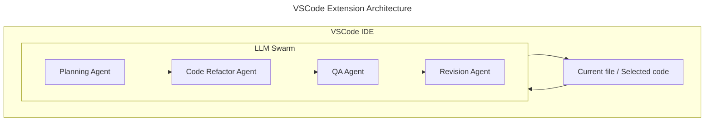

# CrewsControl <!-- omit from toc -->

A code improvement tool utlizing an AI agent swarm.

- [Project Overview](#project-overview)
  - [Description](#description)
  - [Status](#status)
- [Project Installation](#project-installation)
  - [Prerequisites](#prerequisites)
  - [Setup](#setup)
  - [Node.js package management with `npm`](#nodejs-package-management-with-npm)
- [Project Structure](#project-structure)
- [Architecture and Design](#architecture-and-design)
  - [System Overview](#system-overview)
  - [Technologies Used](#technologies-used)
    - [Python package](#python-package)
    - [VSCode Extension](#vscode-extension)
    - [Similar Projects used as references](#similar-projects-used-as-references)
  - [Modules and Components](#modules-and-components)
- [Usage](#usage)
  - [Python Package as CLI tool](#python-package-as-cli-tool)
  - [VSCode extension](#vscode-extension-1)
- [Testing](#testing)

## Project Overview

### Description

This project aims to build code improvement software that utlizes an AI agent swarm using locally hosted models. There are two main components to this project:

- A Python package that can be used as a CLI to perform refactoring tasks.
- A VSCode extension that uses the Python package to perform tasks based on inputs derived from the IDE.

### Status

The package can be used as a basic CLI tool to perform refactoring tasks on input code. It can accept the input as a string, or as a file/folder of files. This CLI functionality is primarily for testing purposes as it is not expected

The VSCode extension allows the user to run the Python .

## Project Installation

### Prerequisites

- [Python 3.12.\*](https://www.python.org/) for running the Python package (as CLI or via extension)
- [Poetry](https://python-poetry.org/) for managing Python dependencies
- [VS Code](https://code.visualstudio.com/) for running the VSCode extension
- [Node.js 16.13.\*](https://nodejs.org/en) for the VSCode extension
- [Jupyter Notebook](https://jupyter.org/) for running the research notebook

> **_Note: a machine with a good GPU is highly recommended_**

### Setup

In terminal, in the root directory of the project, install the Python dependencies and pre-commit hooks by running the following commands:

```shell
poetry install --no-root
poetry run pre-commit install
```

### Node.js package management with `npm`

In terminal navigate to `/vscode-extension` and install the required npm packages by running:

```shell
cd vscode-extension
npm install --save-dev \
  typescript \
  eslint@8.57.0 \
  @typescript-eslint/parser \
  @typescript-eslint/eslint-plugin \
  globals \
  prettier
```

## Project Structure

- Explain the directory structure and the purpose of each folder. (Just the ones you've worked on)
- Mention any key files and their functionalities.
  > The vscode-extension folder is based on a [VSCode Extension Template](https://github.com/microsoft/vscode-python-tools-extension-template)

```text
├── README.md                       This file.
├── pyproject.toml                  Poetry configuration file for Python packages.
├── python-package
│   ├── src
│   │   └── llm-swarm
│   │       ├── ai
│   │       │   ├── agents.py       Defines the AI agents in the crew.
│   │       │   ├── crew.py         Defines the AI crew.
│   │       │   ├── models.py       Functions to retrieve models via Ollama.
│   │       │   └── tasks.py        Defines the tasks that the AI crew can perform.
│   │       ├── main.py             Main entry point for the Python package.
│   │       └── utils
│   │           └── cli.py          CLI tool for running the Python package.
│   └── tests
│       └── input                   Test input files.
├── test.sh                         Bash script for testing the Python package.
└── vscode-extension
    ├── README.md
    ├── bundled
    │   └── tool
    │       └── lsp_server.py       Python code called by extension.
    ├── eslint.config.js
    ├── noxfile.py                  Configuration file for Nox.
    ├── package.json                Node.js configuration file.
    ├── requirements.in             Python package requirements.
    └── src
        └── extension.ts            Main entry point for the VSCode extension.

```

## Architecture and Design

### System Overview



### Technologies Used

#### Python package

- Python
- Poetry for package management
- Ollama
- CrewAI

#### VSCode Extension

- TypeScript
- Node.js
- npm for package management

#### Similar Projects used as references

- Devin: <https://www.cognition-labs.com/introducing-devin>
- AutoGen: <https://github.com/microsoft/autogen>
- CrewAI: <https://github.com/joaomdmoura/crewai>
- ACE Framework: <https://github.com/daveshap/ACE_Framework>
- Hierarchical Autonomous Agent Swarm (HAAS): <https://github.com/daveshap/OpenAI_Agent_Swarm>

### Modules and Components

Breakdown of major modules and their responsibilities.

## Usage

### Python Package as CLI tool

```shell
# use -h to see args
poetry run cli
```

Alternatively, enter the virtual environment with `poetry shell` and then run `python main.py`, or simply run `poetry run python main.py`.

### VSCode extension

## Testing

There is a bash script in the root folder that runs the AI Crew on a set of test files found in `/python-package/tests/input`. Run it with:

```shell
./test.sh
```

# Running the extension

### cd into the vscode-extension directory

cd vscode-extension

# Create a python virtual environment for this project in a terminal

python -m venv venv

### Activate the virtual environment on Windows

.\venv\Scripts\activate

### Install nox in the activated environment

python -m pip install nox

### Run nox --session setup

nox --session setup - Note, you may have to install rust for this.

### Optional: Install test dependencies

python -m pip install -r src/test/python_tests/requirements.txt

### Install node packages

npm install

### Start running

Select 'Run' > 'Start Debugging' from the top menu. This should start both the extension and the language server.